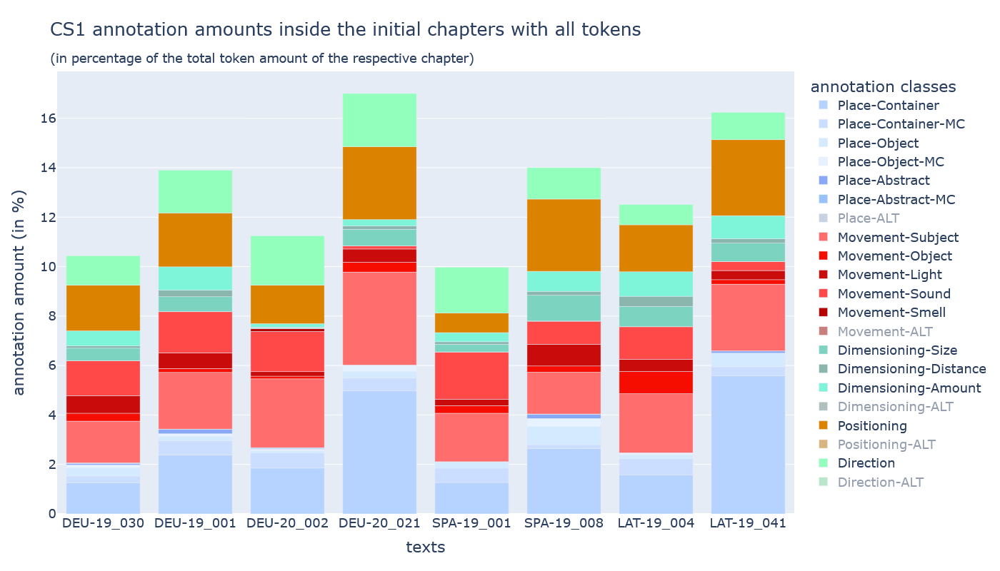

# dh2025

This repository contains the data and code for our short paper "They crossed the valley of Catamarca: A study of narrative space in novel openings" presented at DH2025 in Lisbon.

## Content
### Folders and files
- cs1 annotation data as `.tsv` files:
  - `/canspin-deu-19`
  - `/canspin-deu-20` (for legal reasons, this data from the 20th century is only available as shuffled tsv)
  - `/canspin-spa-19`
  - `/canspin-lat-19`
- cs1 annotation data as Catma project:
  - `/CATMA_4AA4ADC0-4C28-54F9-B6A1-5DCEFF34B90B_DH2025_CANSpiN`
- data and documentation of the novel beginning analysis
  - `/novel_beginning_analysis`
- data and visualizations derived from the analysis:
  - `/results`
- bibliography of the short paper:
  - `bibliography.bib`
- notebook to get analysis results saved in `/result` folder:
  - `perform_analysis.ipynb`

### Corpus overview
It consists of the first chapters of eight german, spanish, and latin-american novels from the 19th and 20th century. The data originates from the corpora of the [European Literary Text Collection (ELTeC)](https://github.com/COST-ELTeC), the [Corpus de novelas hispanoamericanas del siglo XIX (conha19)](https://doi.org/10.5281/zenodo.4766987), the [Complete Works of Uwe Johnson project (CWUJ)](https://www.germanistik.uni-rostock.de/en/forschung/uwe-johnson/werkausgabe/), and E-Books.

| Corpus | ID | Title | Author | Year | Token | Source |
|--------|----|-------|--------|------|-------|--------|
| DEU19 | DEU19_001 | Weisse Sclaven oder die Leiden des Volkes | Willkomm, Ernst Adolf | 1845 | 5491 | ELTeC-deu |
| DEU19 | DEU19_030 | Die verlorene Handschrift | Freytag, Gustav | 1864 | 7179 | ELTeC-deu |
| DEU20 | DEU20_002 | Ansichten eines Clowns | Böll, Heinrich | 1963 | 2689 | E-Book: Kiepenheuer & Witsch 2009 | restricted |
| DEU20 | DEU20_021 | Zwei Ansichten | Johnson, Uwe | 1965 | 744 | CWUJ | restricted |
| SPA19 | SPA19_001 | El Señor de Bembibre | Gil y Carrasco, Enrique | 1855 | 1843 | ELTeC-spa |
| SPA19 | SPA19_008 | Los templarios | Mora, Juan de Dios | 1856 | 4300 | ELTeC-spa |
| LAT19 | LAT19_004 | El falso Inca. Cronicón de la conquista | Payró, Roberto | 1905 | 1210 | conha19 |
| LAT19 | LAT19_041 | El pozo del Yocci | Gorriti, Juana Manuela | 1876 | 1074 | conha19 |

### Annotation overview
#### Classes
The annotation system **CANSpiN.CS1** (v1.1.0) is defined in the respective [guideline](https://doi.org/10.5281/zenodo.10437030).

#### Amount

## Usage
To use the notebook `perform_analysis.ipynb`, install the [gitma-canspin package](https://github.com/CANSpiNproject/gitma-canspin/tree/v1.6.3) following the instructions of its README.

## Licenses
The original texts are in the public domain, with the exception of the German-language novels from the 20th century, which are protected by copyright. Accordingly, the latter data is published here in a derived format as shuffled `.tsv` only.

We publish the annotations under [Creative Commons Attribution International 4.0 licence](https://creativecommons.org/licenses/by/4.0/), the Jupyter Notebook under [GNU General Public License 3](https://www.gnu.org/licenses/gpl-3.0.html).

The [Aspekta](https://github.com/ivodolenc/aspekta) font used for the creation of visualizations with the `Pillow` package in the notebook is licensed under the [Open Font License 1.1](https://openfontlicense.org/open-font-license-official-text/).
